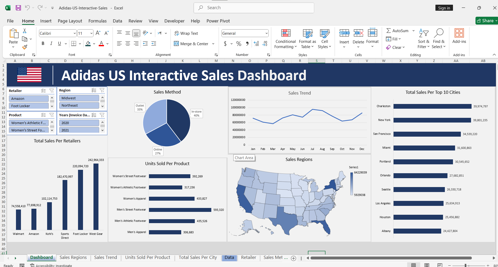

# **Adidas US Interactive Sales Analysis**

### **Objective**
Developed a dynamic sales dashboard to analyze Adidas' market presence across the United States, providing a deep dive into retail performance, product trends, and regional sales distribution.

### **Technical Implementation**
* **Geospatial Visualization:** Integrated a **Map Chart** to track sales density and performance across different US states and regions.
* **Multi-Channel Analysis:** Segmented data by **Sales Methods** (In-store, Online, Outlet) to understand consumer purchasing behavior.
* **Dynamic Interactivity:** Built-in **Slicers** for Years (2020-2021), Regions, Products, and Retailers for granular data exploration.

### **Key Insights**
* **Retailer Dominance:** **West Gear** emerged as the top-performing retailer, contributing over **$242M** in total sales.
* **Channel Performance:** **In-store sales** remain the primary revenue driver at **40%**, highlighting the importance of physical retail presence.
* **Product Popularity:** **Men's Street Footwear** is the highest-volume product category, with over **593,000 units** sold.
* **Top Market Cities:** **Charleston** and **New York** lead the top 10 cities by total sales volume, indicating strong urban market penetration.

---
### **Dashboard Preview**

